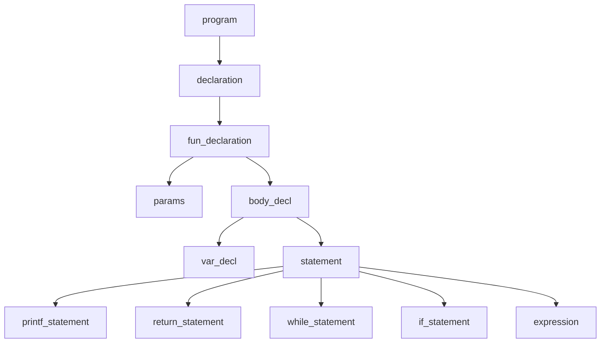
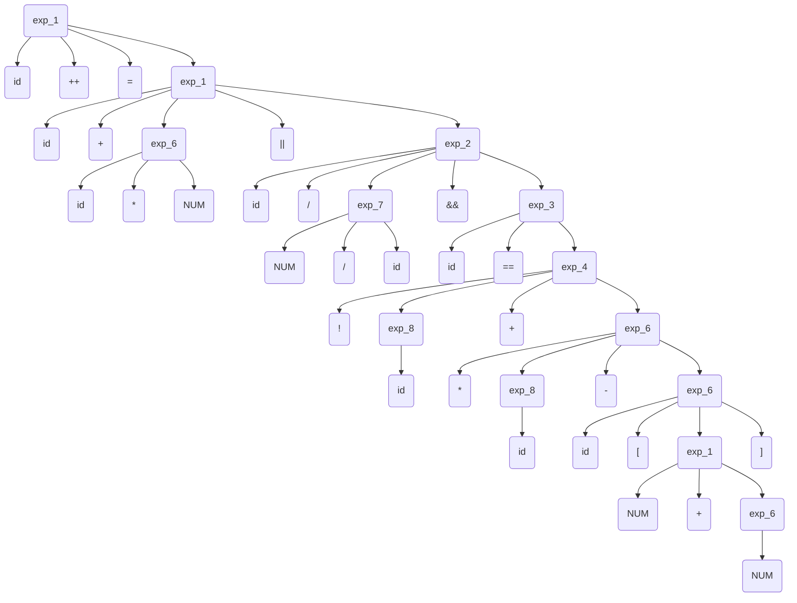

# 研究性文法——实现c语言的子程序的编译器


---
author: jfs


## 1. 问题描述

实现C语言子集的编译器，包括词法分析、语法分析、语义分析、中间代码生成、目标代码生成等功能。包含整型、函数的声明、赋值语句、if else语句、while语句、数组，支持//注释。不支持多级指针，支持数组。  


## 2. 文法定义

``` ebnf
<NUM> ::= <digit>,{<digit>};
<digital> ::= 0|1|2|3|4|5|6|7|8|9;
<ID> ::= <letter>,{(<letter>|<digit>)};
<letter> ::= a|b|c|d|e|f|g|h|i|j|k|l|m|n|o|p|q|r|s|t|u|v|w|x|y|z|A|B|C|D|E|F|G|H|I|J|K|L|M|N|O|P|Q|R|S|T|U|V|W|X|Y|Z;
<string> ::= '"' <character> , {<character>}'"'; 
<character> ::= (*ALL ASCII CHARACTERS EXCEPT *);
<program> ::= {<declaration>};
<declaration> ::= <var-declaration> | <fun-declaration>;
<var-declaration> ::= <type> ['*'] ID ['['NUM']'] {',' ID ['['NUM']']};
<fun-declaration> ::= <type> ['*'] ID '(' <params> ')' '{' <body_decl> '}';
<type> ::= int | void | char;
<params> ::= void | type ['*'] ID {',' type ['*'] ID};
<body_decl> ::={var-declarations>}, {<statement>};
<statement> ::= <selection-stam> | <iteration-list> | <return_stam> | <printf_stam> | <expression> ';';
<selection-stam> ::= 'if' '('<expression>')' '{'{<statement>}'}' | 'if' (<expression>) '{'{<statements>}'}' 'else' '{' {<statements>}'}';
<iteration-stam> ::= 'while' '(' <expression> ')' '{'<statements>'}';
<return-stam> ::= 'return'';' | return <expression>';';
<printf-stam> ::= 'printf''('<string>')'';' | 'printf''('<var>')'';';
<expression> ::= [<var> '='] <or_expression> ';';
<var> ::= ID | ID[<expression>] ;
<additive_expression> | <additive_expression>;

```
表达式文法：
```bnf
 
<expression> ::= <expression_11>
<expression_11> ::= <expression_10> | <expression_11> "||" <expression_10>
<expression_10> ::= <expression_9> | <expression_10> "&&" <expression_9>
<expression_9> ::= <expression_8> | <expression_9> "|" <expression_8>
<expression_8> ::= <expression_7> | <expression_8> "^" <expression_7>
<expression_7> ::= <expression_6> | <expression_7> "&" <expression_6>
<expression_6> ::= <expression_5> | <expression_6> "==" <expression_5> | <expression_6> "!=" <expression_5>
<expression_5> ::= <expression_4> | <expression_5> ">" <expression_4> | <expression_5> "<" <expression_4> | <expression_5> ">=" <expression_4> | <expression_5> "<=" <expression_4>
<expression_4> ::= <expression_3> | <expression_4> ">>" <expression_3> | <expression_4> "<<" <expression_3>
<expression_3> ::= <expression_2> | <expression_3> "+" <expression_2> | <expression_3> "-" <expression_2>
<expression_2> ::= <expression_1> | <expression_2> "*" <expression_1> | <expression_2> "/" <expression_1> | <expression_2> "%" <expression_1>
<expression_1> ::= <expression_0> | "!" <expression_1> | "~" <expression_1> | <expression_1> "++" | <expression_1> "--" | "-" <expression_1> | "&" <expression_1> | "*" <expression_1> | "(" <data_type_com> ")" <expression_1> | "sizeof" <expression_1>
<expression_0> ::= NUM | ID | STRING | <function_call> | <array> | "(" <expression> ")"
```


## 3. 单词列表

标识符：标识符由字母和数字组成，但必须以字母开头。  
常数：非负字符串。  
字符串：双引号括起来的字符序列。  
运算符：+ - * / < <= > >= != == =  
界符：( ) { } [ ] , ; :  " #  
关键字： int void if else while return  printf

标识符、常数、字符串按照一类一码，运算符、界符、关键字按照一符一码。  
### 3.1 编码表
| 单词符号 | 内部编码 | 返回值 |
| --------|---------|--------|
| ID | ID | 
| NUM | NUM |  number value |
| STRING | STRING | address |
| + | PLUS | |
| - | MINUS | |
| * | MUL | |
| / | DIV | |
| < | LT | |
| <= | LE | |
| > | GT | |
| >= | GE | |
| != | NE | |
| == | EQ | |
| = | ASSIGN | |
|int | INT | |
|void | VOID | |
|if | IF | |
|else | ELSE | |
|while | WHILE | |
|return | RETURN | |
|printf | PRINTF | |
|界限符 | 界限符 | |
|分隔符 | 分隔符 | |

### 3.2 符号表
| token | type | value | class | btype | bvalue | btype|
|-------|------|-------|-------|-------|--------|------|
| ID/keyword | int/char | data_addr/stack_offset | fun/loc/glo | store global var


## 4. 程序举例

```c
int a;
int add(int a,int b){
    return a+b;
}
int main(void){
    int b,*c,d[10];
    a=2;
    b=3;
    d[0]=add(a,b);
    a= a+b*a || a-a && a/b + !a + a==b || a>=b;
    if(a>0){
        printf("true");
        printf(a);
    }else{
        printf("false");
    }
    while(a>0){
        a--;
    }
    return 0;
}
```


## 5. 词法分析(lexer.c)

识别出程序中的各个单词，包括关键字、标识符、常量、运算符、界符等。返回token和token_val.
- 标识符：计算出hash值，查找符号表，如果没有则插入符号表，返回ID，在符号表中保存hash和token。
- 常量和字符串：token_val返回常量值和字符串的首地址。
- 运算符和：返回内部编码。
- 界符和分隔符：返回ascii值。
在程序开始时初始化符号表利用keyword函数将关键字插入符号表，修改关键词的Token为关键词编码。

## 6.  语法分析(prase.c)
采用match函数包装get_token函数，用于匹配当前token是否为期望的token，如果不是则报错。  
文法分析采用递归子程序法，子程序调用关系如下图
### 6.1 语法分析子程序调用关系

### 6.2 expression语法分析示例
```c
a++ = a + b*3 || a/2/b && a == !b + *c - d[1+2];
```
优先级：
1. = 
2. ||
3. &&
4. == !=
5. < <= > >=
6. + -
7. * /
8. ! - ++ -- *
9. []
10. ()





## 7. 语义分析(prase.c)
程序举例生成的中间代码见[例子程序的中间代码](#例子程序的中间代码)
### 7.1 四元式格式
利用语法指导的翻译方案生成四元式。
四元式的结构为
|功能| 操作符 | 参数1 | 参数2 | 结果 |
| ---| -----|-------|------|------|
|calc  |  op     |    arg1   |   arg2   |   tmp_arg|
|call  |  call   |    |param  |   func_addr|  
|jnz   |  jnz    |    arg1   |    _     |  addr|
|jump  |  jump   |    _      |    _     |   addr|
|assign|  assign |    arg1   |          |   result|
|printf|  parintf|string_addr|   var    |   _  |
|load  | load    |  tmp     |   _   |   result |

其中op操作有Or,And,Eq,Ne,Lt,Gt,Le,Ge,Plus,Not,Minus,Mul,Div  


### 7.2中间代码生成过程分析
#### 变量定义语句的翻译
type作为继承属性，在识别到id后先将id的全局变量的值保存在Btype、Bclass、Bvalue中。然后补充符号表的type和class，value。其中class时local表示局部变量，global表示全局变量，value保存为变量分配内存空间的地址。
```c
if(token == INT){
            match(INT);
            type = INT;
        }else if(token == CHAR){
            match(CHAR);
            type = CHAR;
        }else if(token == VOID){
            match(VOID);
            type = INT;
        }else{
            printf("line:%d,expect type ,get %d(%c) ",line,token,token );
            exit(-1);
        }
    if(token == MUL){
        match(MUL);
        tmp_type = type+PTR;
    }
    match(ID);
    if(token =='['){
        match('[');
        match(NUM);
        match(']');
        tmp_type = type +PTR;
    }
    current_symbol -> Btype = current_symbol->Type;
    current_symbol -> Type = type;
    current_symbol -> Bclass = current_symbol -> Class;
    current_symbol -> Class = LOC;
    current_symbol -> Bvalue = current_symbol -> Value;
    current_symbol -> Value = params;
    params++;
    while(token != ';' ){
        match(',');
        if(token == MUL){
            match(MUL);
            tmp_type = type + PTR;
        }else{
            tmp_type = type;
        }
        
        match(ID);
        if(token == '['){
            match('[');
            tmp_type = type + PTR;
            match(NUM);
            match(']');
        }
        current_symbol -> Btype = current_symbol->Type;
        current_symbol -> Type = type;
        current_symbol -> Bclass = current_symbol -> Class;
        current_symbol -> Class = LOC;
        current_symbol -> Bvalue = current_symbol -> Value;
        current_symbol -> Value = params;
        params++;
    }
    match(';');
    return;
```
#### if语句和while语句的翻译
if语句先翻译条件表达式，然后生成false跳转指令，翻译真语句，然后生成跳转至语句结束指令，然后回填false跳转指令。翻译假语句，最后回填if跳转指令。
```c
 a = &code->result_value;
 *a = (int)code-(int)first_instr;
```
回填方法时利用指针指向需要回填的代码位置，在到达回填位置时将指针指向的位置赋值为当前代码位置减去第一条指令的位置。  

while语句保存开始地址和指向条件跳转的指针，在语句结尾的无条件跳转时使用保存的开始地址并回填条件跳转指令。
```c
 a = (int)code-(int)first_instr;
 code->result_value = a;
```
#### expression表达式的翻译
表达式利用一个函数表示所有与表示式相关的非终结符，利用level优先级来进行标识区分，并返回左值是否是可复制变量。表达式中每一个子项的运算结果都保存在中间结果tmp中，如果是地址型的tmp需要用load取出值。对于取值和变量都需要把他的值和地址分别保存在tmp中，地址中间变量的编号需要用return返回，而值中间变量的编号保存在最大的tmp编号中。 

当下一运算符的优先级高于当前优先级时保存当前中间结果编号并递归调用expression()运算下一运算符，返回后运算当前运算符；

对于一个运算指令，tmp中包含的值总是一个整型，用于保存中间结果，利用arg_tmp来保存中间结果的编号，用于生成中间代码。于是tmp中的值可以看作为一个值也可以看作为一个地址，如果is_var 不为0，则tmp中的值为地址，否则为值。如果tmp代表一个地址，就可以对这个tmp代表的地址进行赋值运算，load表示对一个地址型tmp进行取值运算。  
语法树详见[expression语法树](#62-expression语法分析示例)

代码结构如下
```c
    //解析前置单目运算符和常量标识符
    if(token == ID){
         ···
    }else if(token == NUM){
        ···
    }else if(token == '('){
        ···
    }else if(token == '!'){
        ···
    //解析双目运算符
    while(token >= level)
    //优先级爬山，level为当前运算符的优先级，token为下一个运算符的优先级，
    //在当前优先级大于下一个优先级时停止
    {
        if(token == '+'){
            ···
        }else if(token == '-'){
            ···
        }
            ···
    }
```
a+b的翻译四元式如下。
| 序号 | 操作 | 参数1 | 参数2 | 结果 |
|------|------|-------|------|------|
0|Plus |[STACK]-1 |0 |Tmp0 |
|1|Load |Tmp0 |0 |Tmp1 |
|2|Plus |[STACK]-2 |0 |Tmp2 |
|3|Load |Tmp2 |0 |Tmp3 |
|4|Plus |Tmp1 |Tmp3 |Tmp4 |

#### expression中赋值语句的处理
主要考虑的是赋值语句需要继承兄弟节点的地址,只有当左值是可赋值变量是赋值语句才合法，涉及到赋值的运算符右 = ++ --.

如何判断左值是可赋值变量：
- 对于双目运算符要保存左值的地址信息，
- 当所需要的值是保存在地址中时，需要用load将值取出来。
- assign只用来赋值，中间结果tmp不能是assign的result，只能是load的result。assign的result只能是地址。
- op类型的code的arg只能是中间结果，内存中的值需要用load取出存放在中间结果tmp中。
- 所有地址都是计算出来后由tmp保存的，传递的参数是tmp的编号。
关于地址：
- 对于指针，地址需要计算，计算的结果保存在表达式的tmp中。地址可能是数据段地址data + offset，也可能是基于栈的地址，是动态地址，bp + offset，可以定义一个地址结构，解析地址类型。
- 根据四元式生成中间代码，生成的中间代码利用tmp保存中间结果，内存地址分为数据段，代码段，栈段。

## 例子程序的中间代码 
| 序号 | 操作 | 参数1 | 参数2 | 结果 |
|------|------|-------|------|------|
|0|Plus |[STACK]-1 |0 |Tmp0 |
|1|Load |Tmp0 |0 |Tmp1 |
|2|Plus |[STACK]-2 |0 |Tmp2 |
|3|Load |Tmp2 |0 |Tmp3 |
|4|Plus |Tmp1 |Tmp3 |Tmp4 |
|5|Jump |0 |0 |[STACK]0 |
|6|Plus |[DATA]0 |0 |Tmp5 |
|7|Load |Tmp5 |0 |Tmp6 |
|8|Plus |2 |0 |Tmp7 |
|9|Assign |Tmp7 |0 |Tmp5 |
|10|Plus |[STACK]1 |0 |Tmp8 |
|11|Load |Tmp8 |0 |Tmp9 |
|12|Plus |3 |0 |Tmp10 |
|13|Assign |Tmp10 |0 |Tmp8 |
|14|Plus |0 |0 |Tmp11 |
|15|Mul |4 |Tmp11 |Tmp12 |
|16|Plus |Tmp12 |[STACK]3 |Tmp13 |
|17|Plus |[DATA]0 |0 |Tmp15 |
|18|Load |Tmp15 |0 |Tmp16 |
|19|Assign |Tmp16 |0 |[STACK]-1 |
|20|Plus |[STACK]1 |0 |Tmp17 |
|21|Load |Tmp17 |0 |Tmp18 |
|22|Assign |Tmp18 |0 |[STACK]-2 |
|23|Assign |[CODE]1344 |0 |[STACK]0 |
|24|Assign |Tmp18 |0 |Tmp13 |
|25|Plus |[DATA]0 |0 |Tmp19 |
|26|Load |Tmp19 |0 |Tmp20 |
|27|Plus |[DATA]0 |0 |Tmp21 |
|28|Load |Tmp21 |0 |Tmp22 |
|29|Plus |[STACK]1 |0 |Tmp23 |
|30|Load |Tmp23 |0 |Tmp24 |
|31|Plus |[DATA]0 |0 |Tmp25 |
|32|Load |Tmp25 |0 |Tmp26 |
|33|Mul |Tmp24 |Tmp26 |Tmp27 |
|34|Plus |Tmp22 |Tmp27 |Tmp28 |
|35|Plus |[DATA]0 |0 |Tmp29 |
|36|Load |Tmp29 |0 |Tmp30 |
|37|Plus |[DATA]0 |0 |Tmp31 |
|38|Load |Tmp31 |0 |Tmp32 |
|39|Minus |Tmp30 |Tmp32 |Tmp33 |
|40|Plus |[DATA]0 |0 |Tmp34 |
|41|Load |Tmp34 |0 |Tmp35 |
|42|Plus |[STACK]1 |0 |Tmp36 |
|43|Load |Tmp36 |0 |Tmp37 |
|44|Div |Tmp35 |Tmp37 |Tmp38 |
|45|Plus |[DATA]0 |0 |Tmp39 |
|46|Load |Tmp39 |0 |Tmp40 |
|47|Not |Tmp40 |0 |Tmp41 |
|48|Plus |[DATA]0 |0 |Tmp42 |
|49|Load |Tmp42 |0 |Tmp43 |
|50|Plus |Tmp41 |Tmp43 |Tmp44 |
|51|Plus |Tmp38 |Tmp44 |Tmp45 |
|52|Plus |[STACK]1 |0 |Tmp46 |
|53|Load |Tmp46 |0 |Tmp47 |
|54|Eq |Tmp45 |Tmp47 |Tmp48 |
|55|And |Tmp33 |Tmp48 |Tmp49 |
|56|Plus |[DATA]0 |0 |Tmp50 |
|57|Load |Tmp50 |0 |Tmp51 |
|58|Plus |[STACK]1 |0 |Tmp52 |
|59|Load |Tmp52 |0 |Tmp53 |
|60|Ge |Tmp51 |Tmp53 |Tmp54 |
|61|Or |Tmp49 |Tmp54 |Tmp55 |
|62|Or |Tmp28 |Tmp55 |Tmp56 |
|63|Assign |Tmp56 |0 |Tmp19 |
|64|Plus |[DATA]0 |0 |Tmp57 |
|65|Load |Tmp57 |0 |Tmp58 |
|66|Plus |0 |0 |Tmp59 |
|67|Gt |Tmp58 |Tmp59 |Tmp60 |
|68|Jnz |Tmp60 |0 |[CODE]4032 |
|69|Print |[DATA]1 |0 |0 |
|70|Print |Tmp60 |0 |0 |
|71|Jump |0 |0 |[CODE]4088 |
|72|Print |[DATA]5 |0 |0 |
|73|Plus |[DATA]0 |0 |Tmp61 |
|74|Load |Tmp61 |0 |Tmp62 |
|75|Plus |0 |0 |Tmp63 |
|76|Gt |Tmp62 |Tmp63 |Tmp64 |
|77|Jnz |Tmp65 |0 |[CODE]4648 |
|78|Plus |[DATA]0 |0 |Tmp65 |
|79|Load |Tmp65 |0 |Tmp66 |
|80|Minus |Tmp65 |1 |Tmp67 |
|81|Assign |Tmp67 |0 |Tmp65 |
|82|Jump |0 |0 |[CODE]4088 |
|83|Plus |0 |0 |Tmp68 |
|84|Jump |0 |0 |[STACK]0 |

## 学习参考

- [「700行手写编译器」Part 1：项目背景与设计思路](https://www.bilibili.com/video/BV1Kf4y1V783/?spm_id_from=333.337.search-card.all.click&vd_source=f1b40d4c8a7cccb5d8d3c3fae7ed593e)bilibili
- [手把手教你构建 C 语言编译器](https://lotabout.me/2015/write-a-C-interpreter-0/)blog
- [重构c4项目仓库](https://github.com/lotabout/write-a-C-interpreter)github
